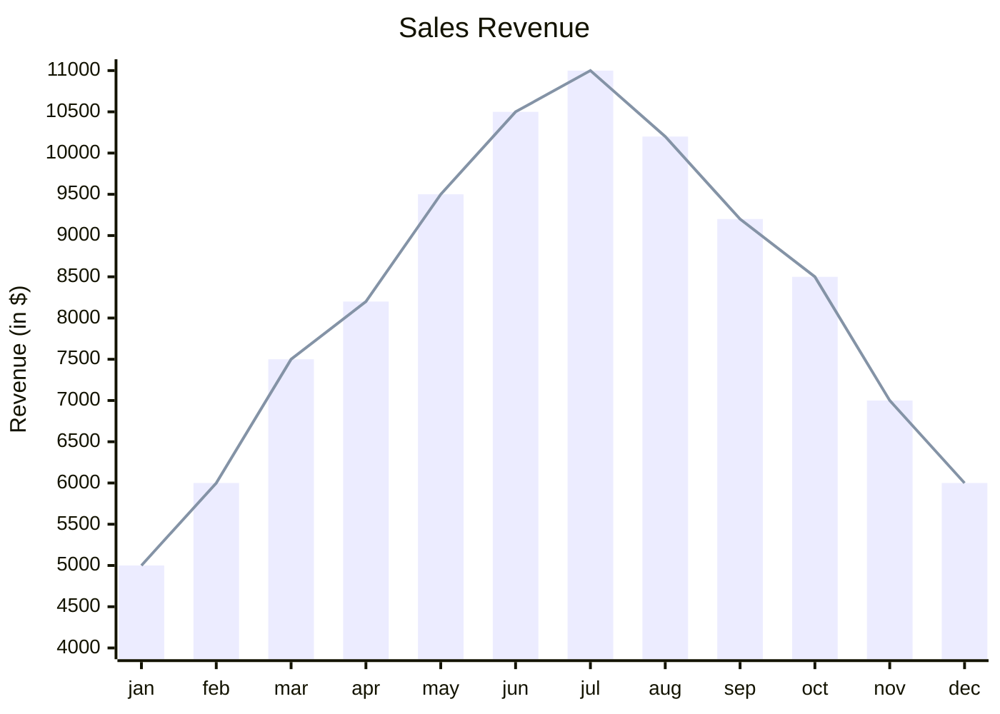

# purescript-resize-arrays

The `resize-arrays` library provides an Array-like data structure which can be resized on both ends efficently. That means adding and deleting items at the front and at the and are performed in constant time.

